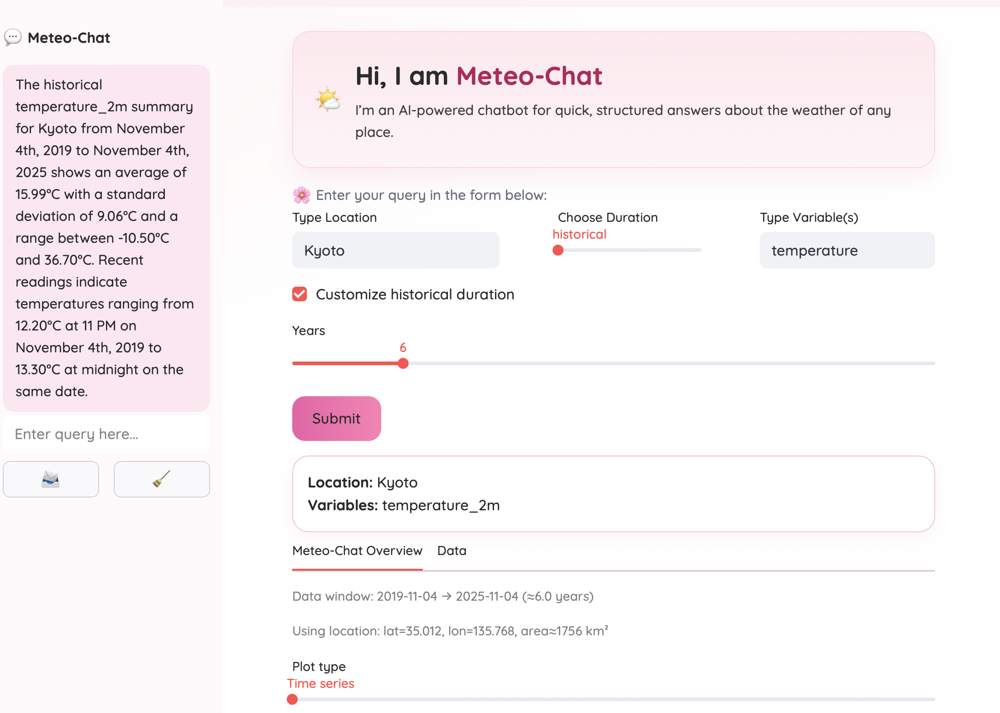
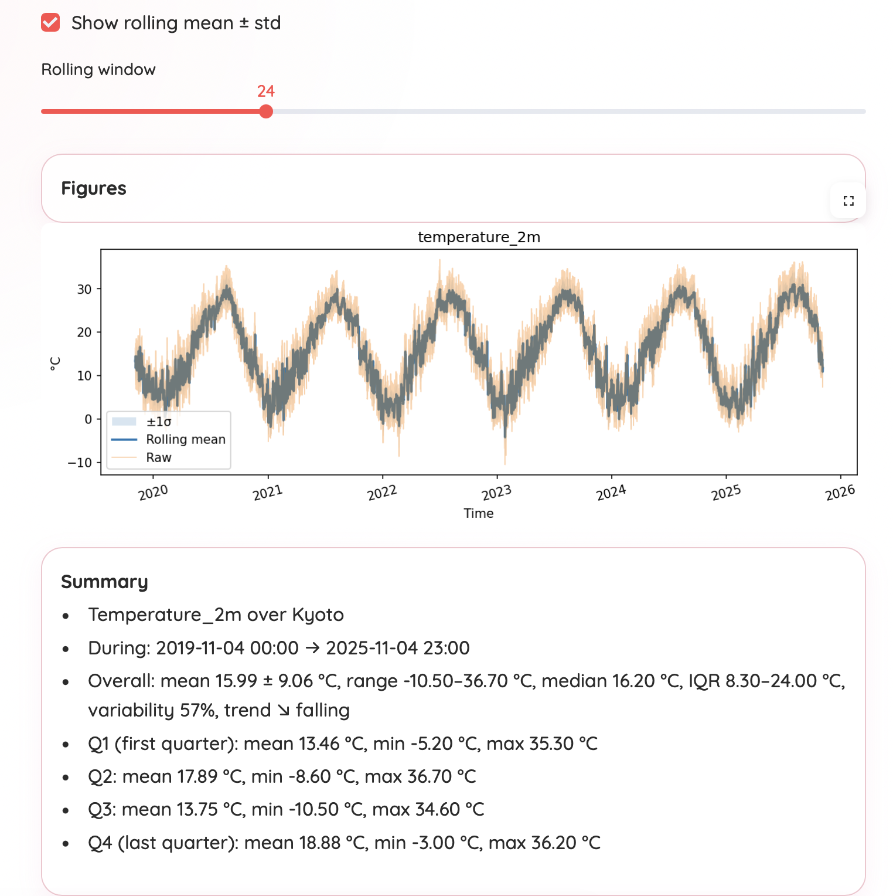
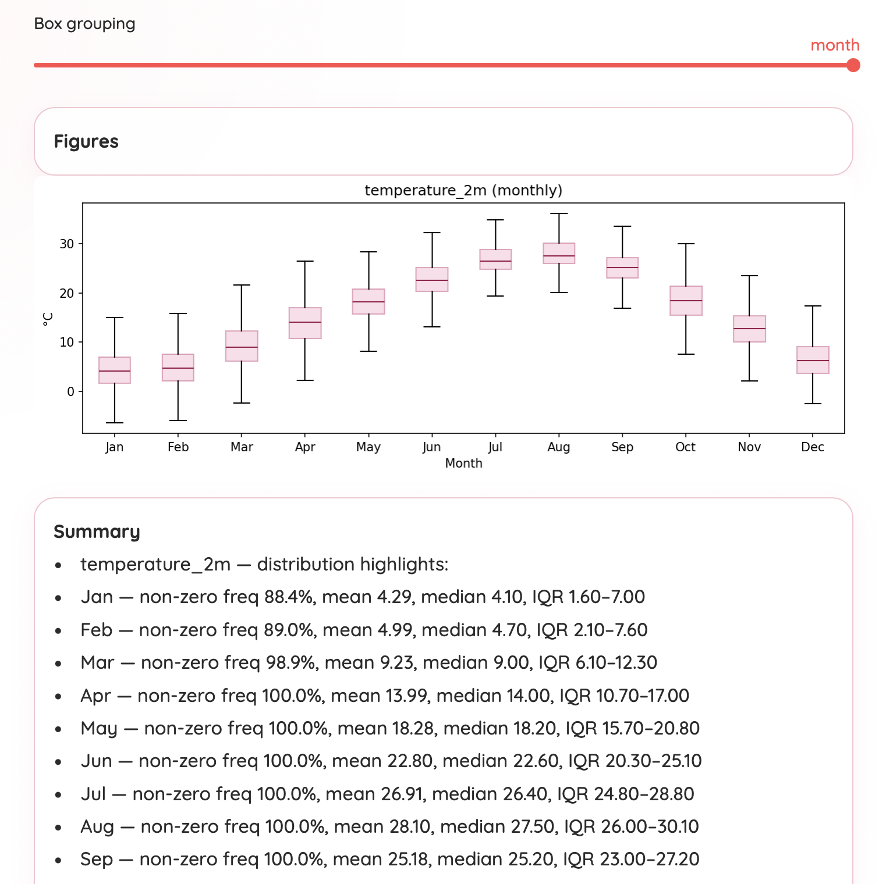

# 🌤️ Meteo-Chat  
*A conversational weather analytics app built around the Open-Meteo API and a local fine-tuned LLM.*

---

## Project Overview

**Meteo-Chat** is an interactive AI-powered weather assistant that combines:
- **Real-time and historical meteorological data** from the [Open-Meteo API](https://open-meteo.com/), which aggregates **ERA5** reanalysis and **numerical weather prediction (NWP)** models,  
- **A local Model-Control-Protocol (MCP) server** for structured dataset planning and execution, and  
- **A locally fine-tuned LLM** trained on meteorological summaries to produce concise, dataset-bounded insights.

The goal is to provide **data-driven, interpretable, and interactive weather summaries**—not random text generation.  

It can summarize, visualize, and converse about weather variables (e.g., temperature, wind, humidity, rain) for any location and timeframe.

<p align="center">
  <br>
  <br>
  
</p>

---

## ✨ What the App Does

- Queries the **Open-Meteo API** for historical, current, or forecasted data.
- Converts **free-form user variables** (like *“wind and rain”*) into canonical API parameters (like `wind_speed_10m`, `precipitation`).
- Produces **interactive time-series and box-plots**, including rolling mean ± std and diurnal/monthly distributions.
- Generates **LLM-based summaries** that remain faithful to data (no hallucinations).
- Works even **offline or without the LLM**, using deterministic statistical fallbacks.
- Provides **downloadable CSVs** (per variable or combined).
- Features a polished **Streamlit UI** with a sidebar chat interface for contextual questions.

---

## Why It’s Interesting

Meteo-Chat demonstrates the integration of **modern AI infrastructure with scientific APIs**, combining multiple technical layers:

| Component | Technology / Skill |
|------------|-------------------|
| Data Source | [Open-Meteo](https://open-meteo.com/), backed by ERA5 & NWP models |
| Data Orchestration | Custom MCP server for API planning/execution |
| Frontend | Streamlit (custom CSS + responsive Quicksand theme) |
| LLM Integration | Local FastAPI inference server (LoRA fine-tuned on meteorological text) |
| Structured Summaries | Custom JSON-schema interface & deterministic fallbacks |
| Visualization | Matplotlib (time-series, rolling mean, IQR boxplots) |
| Packaging | Python `pyproject.toml` with CLI launchers (`meteo-chat`, `meteo-chat-app`) |

The project also showcases:
- **LLM fine-tuning and formatting control**
- **Schema-aware generation**
- **API orchestration via MCP**
- **User-facing data visualization and conversational retrieval**

---

## Key Features

- **Three data modes:** historical, current, forecast  
- **Variable aliasing:** free-form → canonical Open-Meteo parameters  
- **Statistical summaries:** mean, median, std, IQR, range, variability %, and trends  
- **Sparse-aware plots:** rain/snow shown only when non-zero  
- **Deterministic fallbacks:** e.g., “When is max and min temperature seen?” → computed from diurnal cycle  
- **Context-aware chat:** dataset-bounded responses from local LLM  
- **CSV exports:** combined + per variable  
- **Modern UI:** clean cards, tabs, and sidebar chat with Quicksand typography  

---

## Installation

Clone the repository:
```bash
git clone https://github.com/mitraarka27/Meteo-Chat.git
cd weatherai
```

Create a virtual environment and install dependencies:
```bash
python -m venv .venv
source .venv/bin/activate
pip install -r requirements.txt
```

Dependencies include:
```bash
streamlit>=1.33
matplotlib>=3.8
pandas>=2.0
requests>=2.31
```

## How to Run

### Option 1 — Full App (CLI)
```bash
meteo-chat
```

This command:
	1.	Starts the MCP server (http://127.0.0.1:8787)
	2.	Launches the local LLM (http://127.0.0.1:8899)
	3.	Opens the Streamlit UI (http://localhost:8501) in your browser.

### Option 2 — Manual (development)

Terminal 1 — MCP:
```bash
cd mcp_server
npm i && npm run dev
```

Terminal 2 — Streamlit:
```bash
streamlit run apps/streamlit_app/app.py
```

If the browser doesn’t auto-open, visit:
👉 http://localhost:8501

💡 How to Use
	1.	Enter a place name (e.g., “Kyoto”)
	2.	Choose duration:
	•	Historical → Past climatology (customizable years)
	•	Current → Real-time weather
	•	Forecast → Next 1–16 days
	3.	List variables (comma-separated):
temperature, wind, humidity, rain
	4.	Click Submit → Data + visualizations load
	5.	Explore tabs:
	•	Overview → LLM summary, figures, and statistics
	•	Data → Download CSVs
	6.	In the sidebar, chat naturally:

```bash
When is max and min temperature seen?
```

→ The app computes or retrieves the answer.

⸻

🧩 Behind the Scenes

MCP Server

Handles all interaction with Open-Meteo.
Implements /describe_capabilities, /resolve_location, /plan_query, /execute_plan.

Open-Meteo / ERA5

Open-Meteo provides pre-processed ERA5 and NWP model data:
	•	ERA5 (historical): 0.25° reanalysis (ECMWF)
	•	ICON, GFS, GEM, etc. (forecast): multi-model ensemble

Local LLM
	•	Base model: Qwen2.5-1.5B-Instruct
	•	Fine-tuned via LoRA on scientific summaries
	•	Hosted locally via FastAPI
	•	Expects:
POST /generate → { "prompt": "...text..." }
Returns: { "text": "...answer..." }

When unavailable or inconsistent, deterministic fallbacks (Python-based logic) ensure continuity.

⸻

## Challenges & Next Steps

Challenges:
	•	Maintaining low latency for API + LLM calls
	•	Harmonizing units and variable naming across Open-Meteo datasets
	•	Ensuring model outputs remain factual and schema-constrained

## Credits

**Author:** [Arka Mitra, Ph.D.](https://arka-mitra-research.com)  
Atmospheric Scientist · Remote Sensing · AI for Climate & Energy Systems  

Developed independently, leveraging:

- [Open-Meteo API](https://open-meteo.com/)
- [ERA5 Reanalysis (ECMWF)](https://www.ecmwf.int/en/forecasts/dataset/ecmwf-reanalysis-v5)
- [Streamlit](https://streamlit.io/)
- [Qwen2.5 Instruct](https://huggingface.co/Qwen)
- [PyTorch](https://pytorch.org/)
- [FastAPI](https://fastapi.tiangolo.com/)

⚖️ License

MIT License © 2025 Arka Mitra
You’re free to use, modify, and share this code with attribution.

⸻

⭐ Summary

Meteo-Chat is not a chatbot.
It’s a scientific analytics companion—a bridge between numerical weather prediction data and interpretable, LLM-assisted insight.
Built end-to-end by a scientist for scientists, data analysts, and anyone curious about the dynamics behind the numbers.